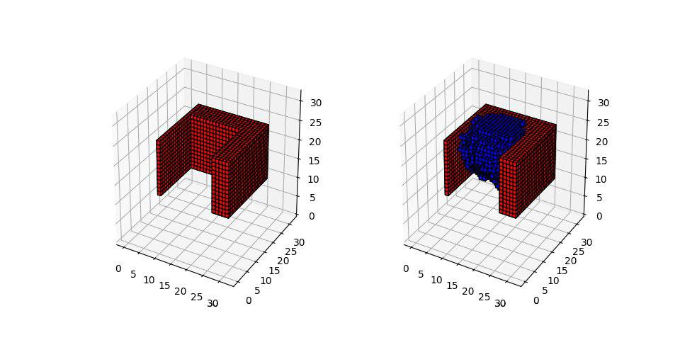
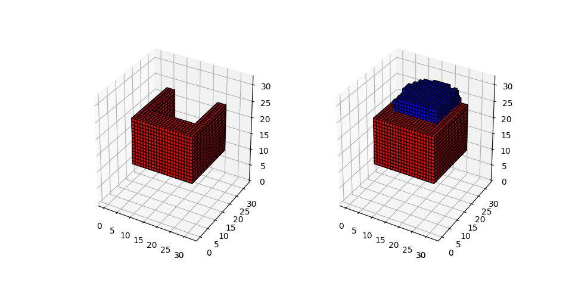
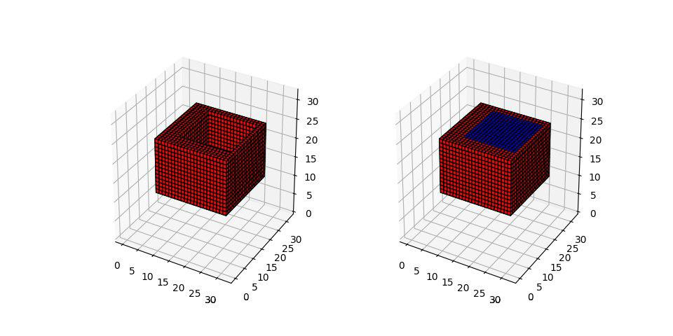

# 3D Shape Completion 

## Introduction

This is a Keras Implementation of 3D Encoder-Decoder Generative Adversarial Network (3D-ED-GAN) for 3D shape Inpainting. The 3D-ED-GAN is a 3D convolutional neural network trained with a generative adversarial paradigm to fill missing 3D data. The cuboid data is generated through Python code and a random masking is applied to each instance to create corrupted shapes. 

In this experiment, since the shape is pretty simple, the network gives excellent performance after 10 mins of training on GPU.  

## Requirement

Tensorflow-gpu==1.7.0

Keras==2.20

## Example

~~~
python EncoderDecoderGAN3D.py
~~~

For the fist few epochs: 

After 2000 epochs:

## Reference

[1] [https://github.com/eriklindernoren/Keras-GAN](https://github.com/eriklindernoren/Keras-GAN)

[2] [Shape Inpainting using 3D Generative Adversarial Network and Recurrent Convolutional Networks](https://arxiv.org/abs/1711.06375) Weiyue Wang, Qiangui Huang, Suya You, Chao Yang, Ulrich Neumann. 

## Contact 

**Maker Collider**

**Shiyu Mou**

**shiyumou@usc.edu**